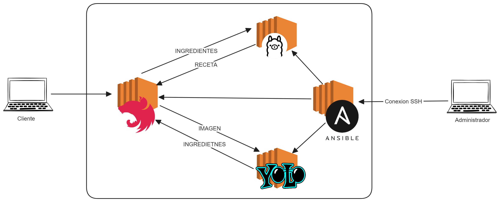
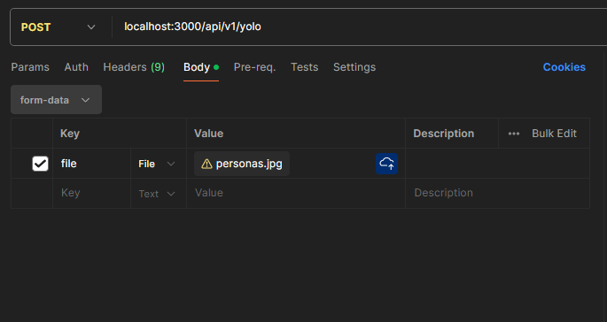

# Manda una foto, obten una receta

## ¿ Como funciona el proyecto ?

El proyecto esta divido en tres partes:
- 1. El modelo de lenguaje
- 2. El modelo de visión por computadora
- 3. El servidor de Back end.

Una aplicación movil manda una fotografia de lo que contiene el refrigerador, esta fotografía llega a un endpoint en el backend.

Mandar un jpg a:
```
http://fridgerecipies/api/v1/yolo
```
El backend manda la foto al servidor del modelo de visión por computadora. El modelo de visión por computadora responde con una lista de ingredientes al back.

El backend recibe la lista de ingredientes y formatea un prompt para el modelo de lenguaje. Manda los ingredientes al modelo de lenguaje y este contesta con una receta.

El backend manda la receta a la aplicación movil.

### Proyecto en cloud

Este proyecto está pensado para ejecutarse en un entorno cloud con la siguiente arquitectura:

1. Para ejecutar el proyecto en cloud es necesario configurar 4 EC2 en AWS, el EC2 de Ollama debe de ser un LargeX2, que cumpla con 8GB de RAM para ejectuar el modelo.

2. Al momento de hacer la configuraicón pasar la llave para SSH al EC2 de ansible.

3. Pasar el `playbook.yaml` a Ansible y configurar el archivo `hosts.template` con las ips privadas de la red de EC2´s, los usuarios y con la llave de acceso de SSH para el acceso de ansible.

### Probar el proyecto en local.

1. Ingresa a ` ./ollama `

2. Ejecuta el comando ``` docker compose -f docker.ollama.compose up -d ```. Esto descargará la imagen de docker de ollama y ejecutara el contenedor del modelo.

3. Abre una terminal y ejecuta el comando ``` docker exec -it ollama ollama run llama2 ```
Esto ejecuta el modelo de lenguaje llama2, es necesario contar con minimo 8Gb de RAM disponibles para el modelo.

4. Ingresa a ``` ./server_backend ``` y ejecuta ``` npm run start:dev ``` esto levantará el backend.

5. Ingresa a `./yolo/yolo_env/src`, instala los paquetes necesarios: `pip install -r requirements.txt`, despues de instalar las dependencias levanta el servidor de `uvicorn main:app --reload`,

6. Abre postman o Insombra y envia un **post** al end point ``` http://localhost:3000/api/v1/ollama```
**Body:**
```
{
    file:'tu_imagen_pa_recetas.jpg'
}
```
7. Tu request deberá lucir de la siguiente manera:

7. El modelo respondera con la receta.